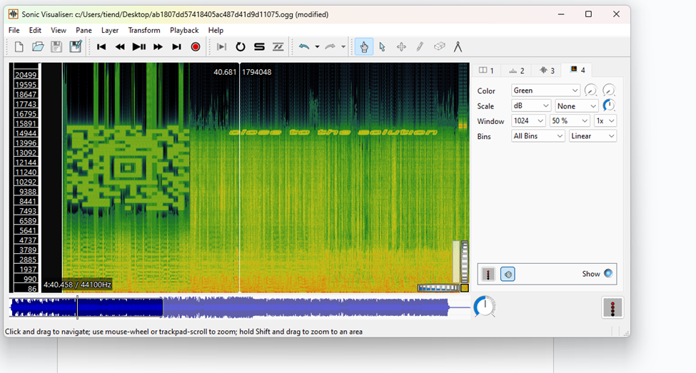
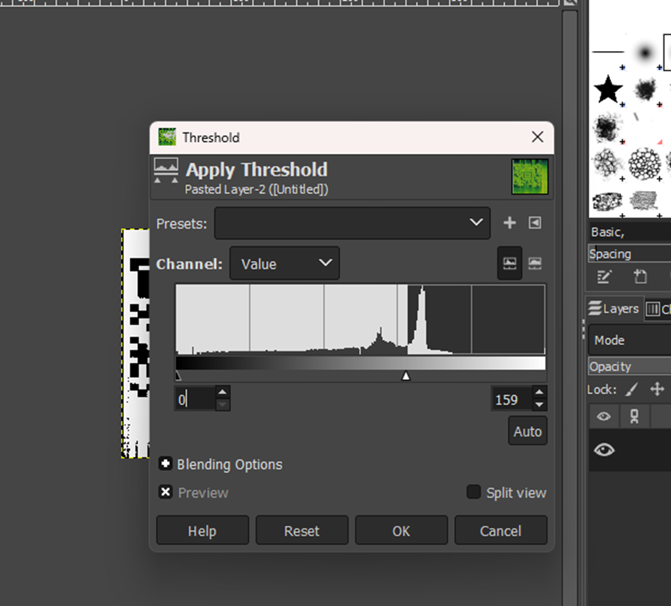

#**SigID Level 1**
- Bài này chúng ta sử dụng phần mềm Sonic Visualizer, dùng để phân tích file audio. Sau khi tải phần mềm, mở file .ogg, sau đó chọn Layer -> Add Spectogram:

- Một mã QR xuất hiện, chúng ta giảm green-noise bằng cách sử dụng phần mềm GIMP Image Editor

Sau đó quét mã QR và ta tìm được flag là mathsRulesTheUniverse.