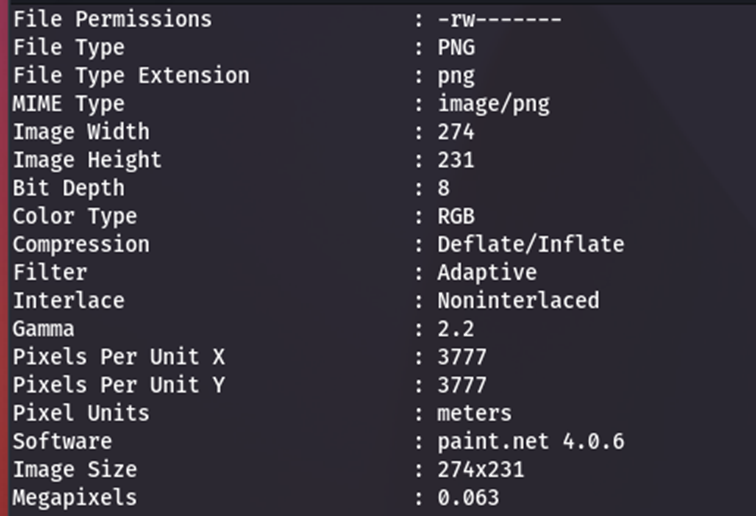
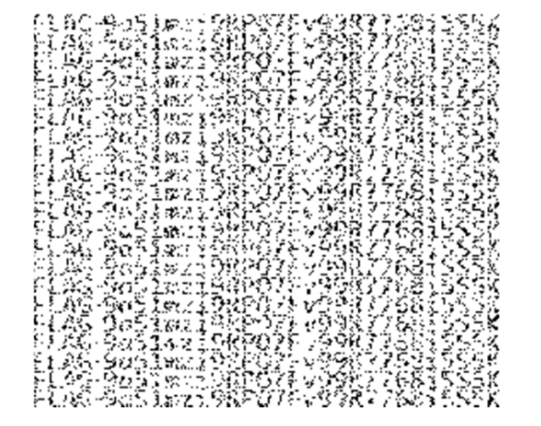
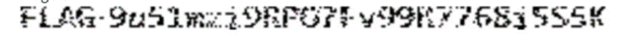

#**Pixel everywhere**

- Bài lab được thực hiện trên Kali Linux.
Trước hết sử dụng phần mềm Exiftool để check metadata của ảnh:

- Ta thấy phần software có comment paint.net - đây là 1 tool chỉnh sửa ảnh, đây là dấu hiệu cho việc steganography qua ảnh (visual steganography). Tool được sử dụng là StegSolve để giải mã và chọn mode gray bits:

- Ta sẽ thu được 1 ảnh, có chữ FLAG ở đầu cho thấy đây là flag cần tìm. Việc còn lại là làm nét ảnh để thu được kết quả. Ta dùng phần mềm GIMP và copy từng dòng, cho đè lên nhau để thu được ảnh:

Từ đây có thể tìm được kết quả là FLAG-9a51mzi9RPO7Fv99R7768i5s5k.