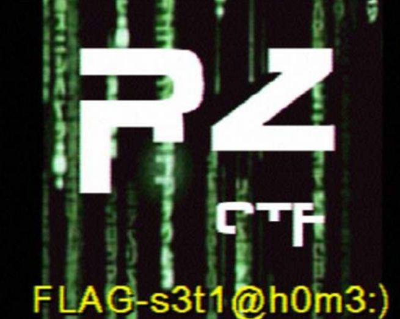

#**The vestige of dial-up Internet**
Với file .wav cho trước, khi ta mở lên khá giống âm thanh của modem dial-up, gợi đến tín hiệu SSTV (slow-scan television). Vì thế, ta dùng phần mềm QSSTV để giải mã file âm thanh và thu được hình ảnh, dùng cho Linux.

Ta thu được flag là FLAG-s3t1@h0m3:) và đây là kết quả.