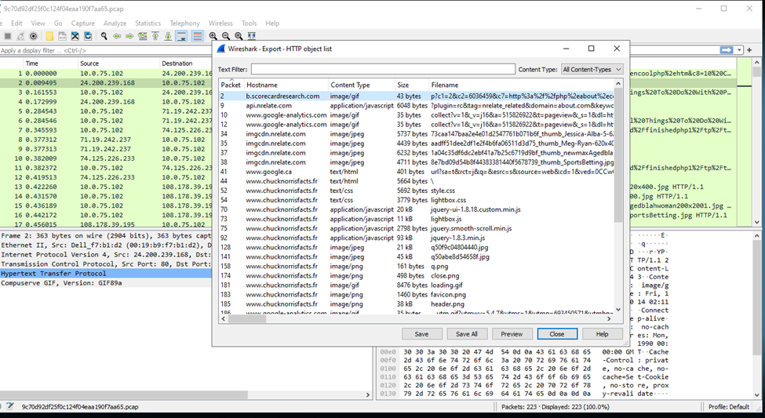
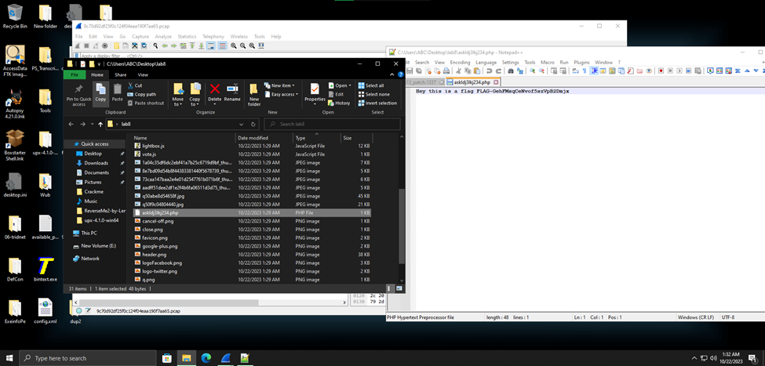

#**Hey Chuck where is the flag?**
- File với định dạng pcap gợi ý ta dùng Wireshark để mở:

- Không có dấu hiệu gì bất thường ở các list connect, ta thử export file http object list:

- Ở đây có 1 file php đáng nghi, sử dụng Notepad++ để mở file đó:

Ta thu được flag cần tìm.