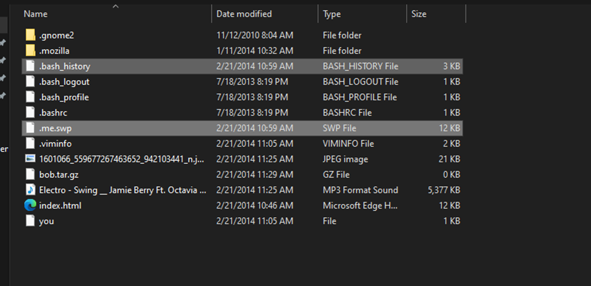
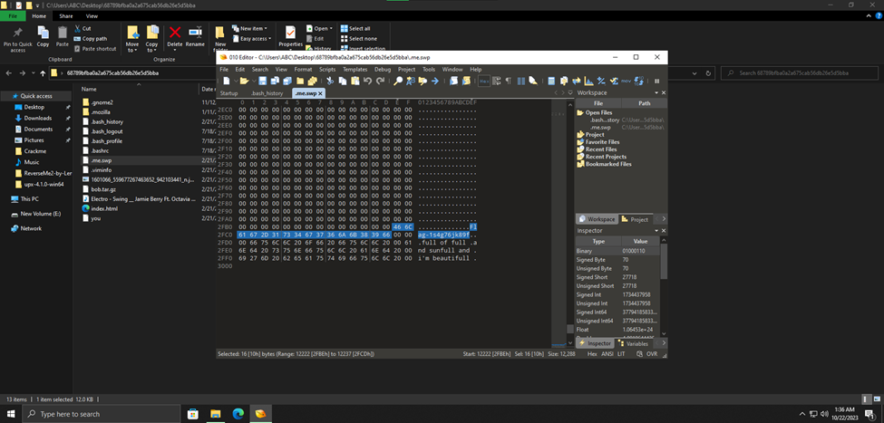

#**Hide my ass in my home**
- Ở đây ta chú ý 2 file: .bash_history lưu lại các command Linux và .me.swp là file Vim swap.

- Sử dụng 010 Editor hoặc Strings để check strings của file .me.swp, ta thu được flag.
